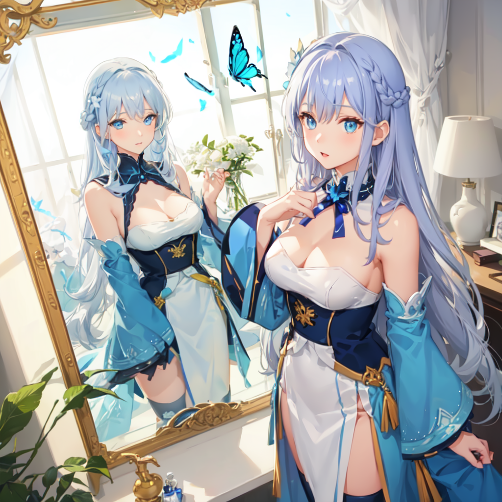
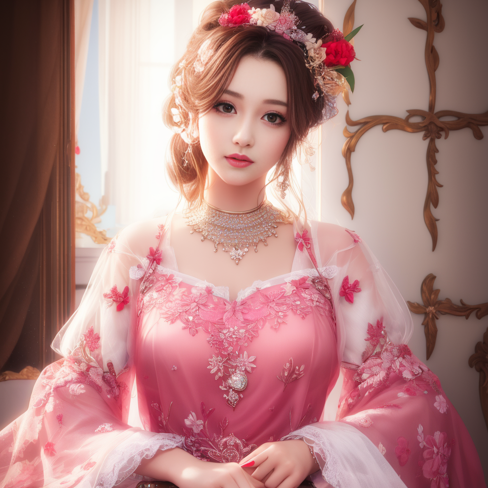

# 进入网站
http://127.0.0.1:7860/

## 使用方法

### 方法一


### 方法二


### 方法三-人体姿势检测


# 模型介绍

## 模型: elegantHanfuRuqun_v10.safetensors
```
ru_qun,best_quality,head,original_outfit,hanfu,clear details,masterpiece, best_quality, clear details,1girl,all four,on stomach,from back,cowboy shot,   <lora:ruqun-000009:1>
Negative prompt: pale skin,(worst quality, low quality, normal quality:1.4),(inaccurate limb:1.2),white background,simple background,bad anatomy, bad hands, text, error, extra digit, fewer digits, cropped, worst quality, low quality, normal quality, jpeg artifacts,signature, watermark, username, blurry, artist name,bad feet,(((ugly))),(((duplicate))),((morbid)),((mutilated)),(((tranny))),mutated hands,(((poorly drawn hands))),(((blurry))),((bad anatomy)),(((bad proportions))),extra limbs,cloned face,(((disfigured))),(((more than 2 nipples))),((((missing arms)))),(((extra legs))),mutated hands,(((((fused fingers))))),(((((too many fingers))))),(((unclear eyes))),sad,missing fingers, low quality body parts, missing body parts, disproportional body parts, indistinguishable body parts, branched body parts, bent, body parts, rheumatism finers, ugly fingers, melted fingers, too fat, too skiny, low quality female, low quality male, poor colors, low quality clothes, poor background, wholesome, 3D, CG, less details, censored, multiple legs, Lesbian, gay,
ENSD: 31337, Size: 480x640, Seed: 3253182695, Steps: 20, Sampler: DPM++ 2M Karras, CFG scale: 7, Clip skip: 2, Model hash: e4b17ce185, Hires steps: 10, Hires upscale: 1.5, Hires upscaler: ESRGAN_4x, Denoising strength: 0.55
```


## 模型: meinamix_meinaV7.safetensors
```
(Overhead view),dynamic angle,ultra-detailed, illustration, close-up, straight on, 1girl, (fantasy:1.4), (azure blue eyes:1.233),Her eyes shone like dreamy stars,(glowing eyes:1.233),(beautiful and detailed eyes:1.1),(Silver hair:1.14),(messy hair,very long hair,french braid,hair between eyes,sidelocks), (+(bule hair flower:1.14)),(chiffon dress,bule flower pattern in uniform)/=(military uniform:1.24),(detached sleeves,wide sleeves),(fingerless gloves),choker,(miko thighhighs),High heeled boots,(expressionless,closed mouth),(standing), (classical Princess boudoir with dressing table<books> and french window<a epic view outside the window> in a white ancient palaces),(white flowers,bloom),(abysmal sea),(flowing water),(a dull blue world tree:1.14),(ruins),(night:1.2),dreamy,soul,(fluorescence),(flying translucent blue butterflies:1.15), [[delicate fingers and hands:0.55]::0.85],(detail fingers),(yubao:0.5),
Negative prompt: (worst quality, low quality:1.4), monochrome, zombie,
Size: 512x1024, Seed: 2073347904, Model: Meina V7 - pruned, Steps: 50, Sampler: Euler a, CFG scale: 7, Clip skip: 2, Model hash: 9d77664fea, Hires steps: 20, Hires upscale: 2, Hires upscaler: None, Denoising strength: 0.3
```


## stablydiffuseds_26.safetensors
```
1girl, beautiful, realistic

Negative prompt: (((simple background))),monochrome ,lowres, bad anatomy, bad hands, text, error, missing fingers, extra digit, fewer digits, cropped, worst quality, low quality, normal quality, jpeg artifacts, signature, watermark, username, blurry, lowres, bad anatomy, bad hands, text, error, extra digit, fewer digits, cropped, worst quality, low quality, normal quality, jpeg artifacts, signature, watermark, username, blurry, ugly,pregnant,vore,duplicate,morbid,mut ilated,tran nsexual, hermaphrodite,long neck,mutated hands,poorly drawn hands,poorly drawn face,mutation,deformed,blurry,bad anatomy,bad proportions,malformed limbs,extra limbs,cloned face,disfigured,gross proportions, (((missing arms))),(((missing legs))), (((extra arms))),(((extra legs))),pubic hair, plump,bad legs,error legs,username,blurry,bad feet

Steps: 30, Sampler: Euler a, CFG scale: 6, Seed: 1882365488, Face restoration: CodeFormer, Size: 512x512, Model hash: 03df69045a, Model: stablydiffuseds_26, Denoising strength: 0.7, ControlNet Enabled: True, ControlNet Module: openpose, ControlNet Model: control_sd15_openpose [fef5e48e], ControlNet Weight: 1, ControlNet Guidance Start: 0, ControlNet Guidance End: 1, Hires upscale: 2, Hires steps: 30, Hires upscaler: Latent (bicubic antialiased)
```
