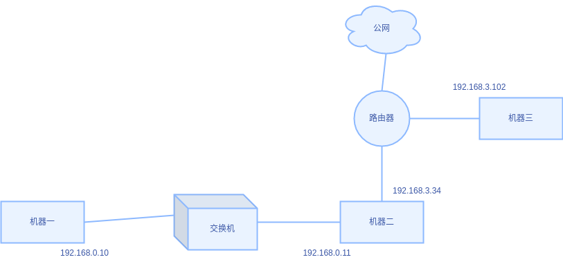

# 1. 使两台机器通过交换机连通
1.1 网络结构：


1.2 网络现状：机器一和机器二不通。

1.3 原因分析：当前两台机器都是自动获取IP模式，但是交换机不分配IP。

1.4 目标：机器一和机器二连通。

1.5 操作：

给机器一设置 IP 和子网掩码(不设置网关)：

- address: 192.168.0.10
- netmask: 255.255.255.0

给机器二设置 IP 和子网掩码(不设置网关)：

- address: 192.168.0.11
- netmask: 255.255.255.0
```
# 临时修改
# ifconfig 网卡名称 IP地址 netmask 子网掩码
sudo ifconfig eno2 192.168.0.11 netmask 255.255.255.0
```
1.6 测试连通:
```
# 机器一
ping 192.168.0.11
```
```
# 机器二
ping 192.168.0.10
```
测试连通成功
# 2. 使机器一 192.168.0.0/24 的网段，可以跟机器二的 192.168.3.0/24 的网段互通
1.2 网络结构：



1.2 网络现状：机器一和机器二 192.168.0.11 的 IP 互相连通，机器一和机器二 192.168.3.34 的 IP 互相不通。

1.3 原因分析：两个网段不通。

1.4 目标：使机器一 192.168.0.0/24 的网段，可以跟机器二的 192.168.3.0/24 的网段互通。

1.5 操作：

机器一
```
sudo route add -net 192.168.3.0 netmask 255.255.255.0 gw 192.168.0.11
```
机器二
```
iptables -t nat -A POSTROUTING -s 192.168.0.0/24 -d 192.168.3.0/24 -o wlo1 -j MASQUERADE
iptables -t nat -A POSTROUTING -s 192.168.3.0/24 -d 192.168.0.0/24 -o eno2 -j MASQUERADE
```
机器三
```
sudo route add -net 192.168.0.0 netmask 255.255.255.0 gw 192.168.3.34
```
1.6 测试连通:
```
# 机器一
ping 192.168.3.102
```
```
# 机器三
ping 192.168.0.10
```
测试连通成功
